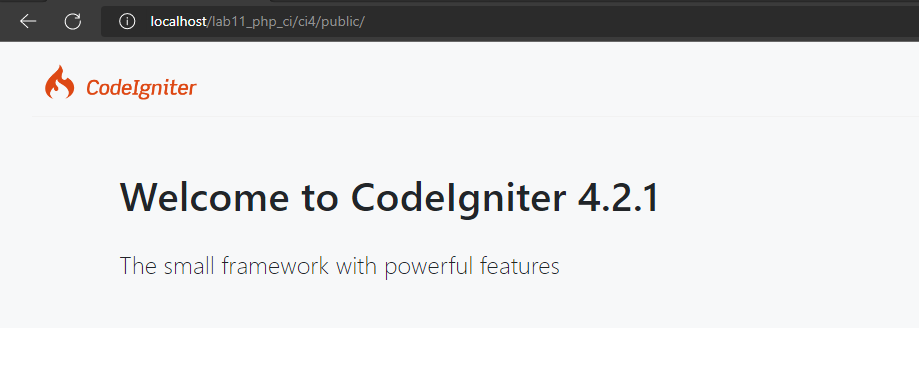
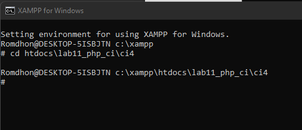
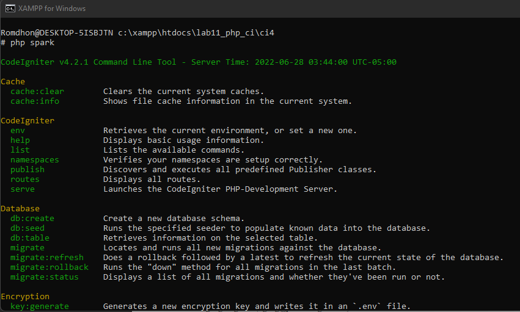

# Lab11Web
| Nama  | Muhammad Romdhon    |
| ------- | ----------------- |
| NIM   | 312010434          |
| Kelas | TI.20.A.1          |

## Langkah-langkah praktikum 11

## 1. Buat file baru dengan nama header.php
### Instalisasi Codeigniter 4
Untuk melakukan instalisasi Codeigniter 4 dapat dilakukan dengan dua cara, yaitu cara manual dan menggunakan *composer*. Pada praktikum ini kita menggunakan cara manual

* Unduh Codeigniter dari website https://codeigniter.com/download
* Extrak file codeigniter ke direktori htdocs/lab11_ci
* Ubah nama direktory framework-4.x.xx menjadi ci4
* buka browser dengan alamat http://localhost/lab11_ci/ci4/public/

## 2. Menjalankan CLI (Command Line Interface)
Codeigneter 4 menyediakan CLI untuk mempermudah proses development. Untuk mengakses CLI buka terminal/command prompt.
 
Arahkan lokasi dirokteri sesuai dengan direktori kerja project dibuat (xampp/htdocs/lab11_ci/ci4)

Perintahkan yang dapat dijalankan untuk memanggil CLI Codeigniter adalah:
|php spark|
|----------|
 