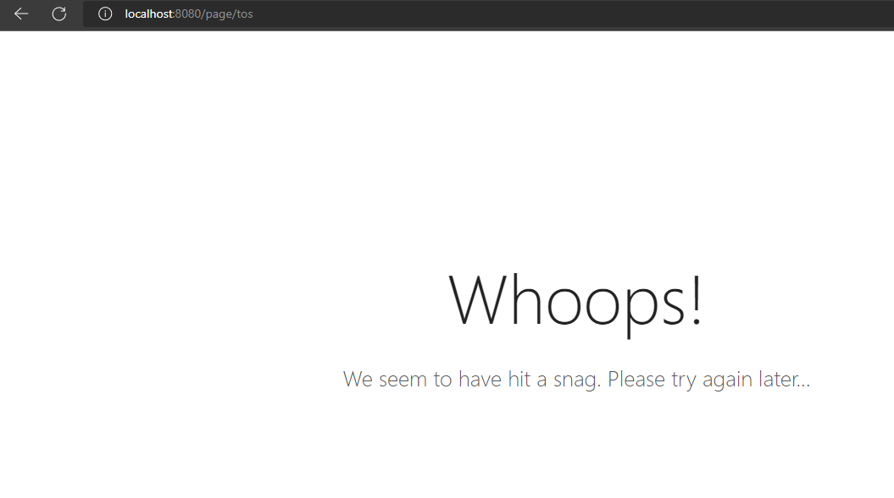

# Lab11Web
| Nama  | Muhammad Romdhon    |
| ------- | ----------------- |
| NIM   | 312010434          |
| Kelas | TI.20.A.1          |

## Langkah-langkah praktikum 11

## 1. Buat file baru dengan nama header.php
### Instalisasi Codeigniter 4
Untuk melakukan instalisasi Codeigniter 4 dapat dilakukan dengan dua cara, yaitu cara manual dan menggunakan *composer*. Pada praktikum ini kita menggunakan cara manual

* Unduh Codeigniter dari website https://codeigniter.com/download
* Extrak file codeigniter ke direktori htdocs/lab11_ci
* Ubah nama direktory framework-4.x.xx menjadi ci4
* buka browser dengan alamat http://localhost/lab11_ci/ci4/public/

## 2. Menjalankan CLI (Command Line Interface)
Codeigneter 4 menyediakan CLI untuk mempermudah proses development. Untuk mengakses CLI buka terminal/command prompt. 
 
Arahkan lokasi dirokteri sesuai dengan direktori kerja project dibuat (xampp/htdocs/lab11_ci/ci4)

Perintahkan yang dapat dijalankan untuk memanggil CLI Codeigniter adalah: 
php spark 
 
## 3. Mengaktifkan Mode Debugging 
Codeigniter 4 menyediakan fitur debugging untuk memudahkan developer untuk mengetahui pesan error apabila terjadi kesalahan dalam membuat kode program. 

Secara defalut fitur ini belum aktif. Ketika terjadi error pada aplikasi akan ditampilkan pesan kesalahan seperti berikut.  
 
Semua jenis error akan ditampilkan sama. Untuk memudahkan mengetahui jenis errornya, maka perlu diaktifkan mode debugging dengan mengubah nilai konfigurasi pada environment variabel CI_ENVIRINMENT menjadi development. 
 
Ubah nama file env menjadi .env kemudian buka file tersebut dan ubah nilai variable CI_ENVIRINMENT menjadi development. 